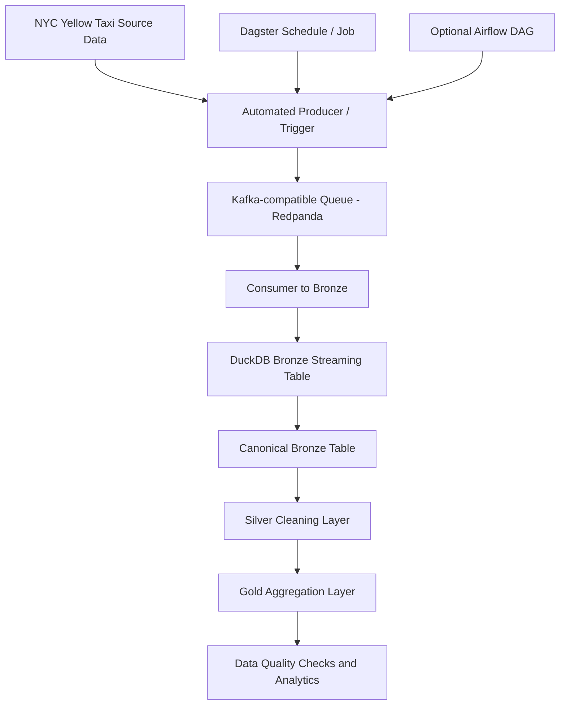

# Updated Streaming Architecture

The previous version of the project loaded source files directly into the Bronze layer. This version adds a queue system between the source reader and the Bronze layer.

## Logical flow



## Physical components

| Component | File / service | Responsibility |
|---|---|---|
| Source reader | `streaming/producer.py` | Reads NYC Yellow Taxi Parquet rows |
| Queue system | Redpanda in `docker-compose.yml` | Stores events in topic `nyc_taxi_raw` |
| Consumer | `streaming/consumer_to_bronze.py` | Reads queue messages and appends them to DuckDB Bronze |
| Warehouse | `warehouse.duckdb` | Stores Bronze, Silver and Gold tables |
| Transformations | `sql/*.sql` | Builds medallion layers |
| Trigger/orchestration | `orchestration/dagster_pipeline.py` | Runs ingestion and transformations automatically |
| Optional trigger | `airflow/dags/nyc_taxi_streaming_dag.py` | Optional Airflow representation of the same flow |

## Queue-based ingestion

The new ingestion path is:

```text
source -> producer -> queue -> consumer -> bronze
```

This replaces the older direct loading pattern:

```text
source -> bronze
```

The queue adds decoupling between the source-reading process and the warehouse-loading process. This is useful because producer and consumer can be scaled or retried independently.

## Medallion layers

- Bronze keeps queue-ingested raw records and ingestion metadata.
- Silver filters and standardizes records.
- Gold provides analysis-ready aggregations.

## Data quality

The project creates `data_quality_summary` with checks for:

- invalid pickup/dropoff time order
- invalid or missing trip distance
- missing pickup/dropoff location IDs
- negative or missing total amount
